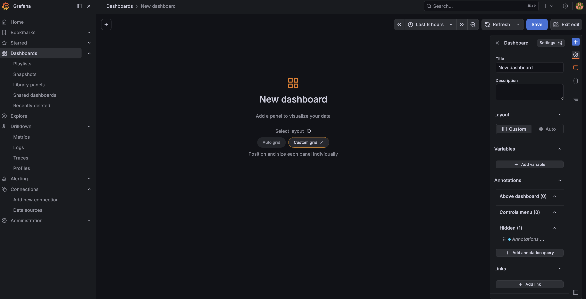
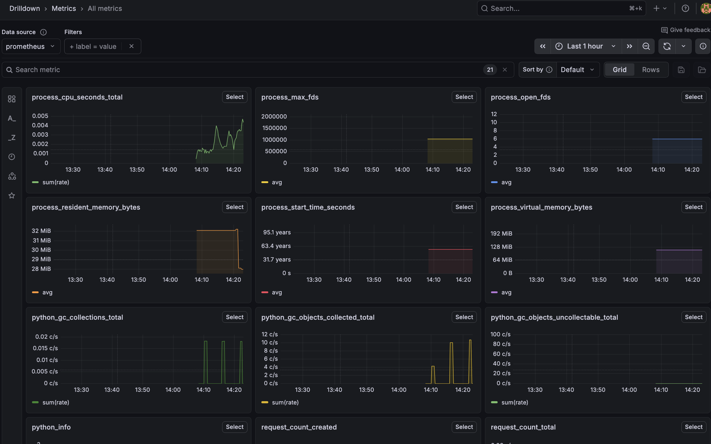

# DevOps Portfolio Project

End-to-end infrastructure project: from code to production with CI/CD, containerization, and monitoring.

## Stack

- **Frontend** — static HTML served by Nginx
- **Backend** — Python Flask API with Prometheus metrics
- **Database** — PostgreSQL with persistent volume
- **Reverse Proxy** — Nginx (routing, static files)

## CI/CD Pipeline (GitHub Actions)

Every push to `main` triggers:

1. **Lint** — code style check (flake8)
2. **Test** — unit tests (pytest)
3. **Build** — Docker images for frontend and backend
4. **Push** — images to GitHub Container Registry (ghcr.io)
5. **Deploy** — SSH to VPS, pull new images, restart containers

## Kubernetes (Minikube)

Local K8s cluster for learning and demonstration:

- **Deployment** — self-healing pods (auto-restart on failure)
- **Service** — stable networking between components
- **ConfigMap** — Prometheus scrape configuration
- **Prometheus** — metrics collection from backend `/metrics` endpoint
- **Grafana** — dashboard with request count, response time, and alert rule

## Project Structure

```
devops_final_project/
├── .github/workflows/
│   └── ci.yml
├── ansible/
│   ├── deploy.yml
│   └── inventory/hosts
├── backend/
│   ├── app.py
│   ├── test_app.py
│   ├── requirements.txt
│   ├── Dockerfile
│   └── .dockerignore
├── frontend/
│   ├── index.html
│   └── Dockerfile
├── nginx/
│   └── nginx.conf
├── docker/
│   ├── docker-compose.yml
│   └── .env.example
└── k8s/
    ├── deployment.yaml
    ├── service.yaml
    ├── prometheus.yaml
    └── grafana.yaml
```

## Routes

- `/` — Frontend
- `/api/health` — Backend healthcheck
- `/api/hello` — Backend hello
- `/metrics` — Prometheus metrics

## Screenshots

### CI/CD Pipeline


### Grafana Dashboard

